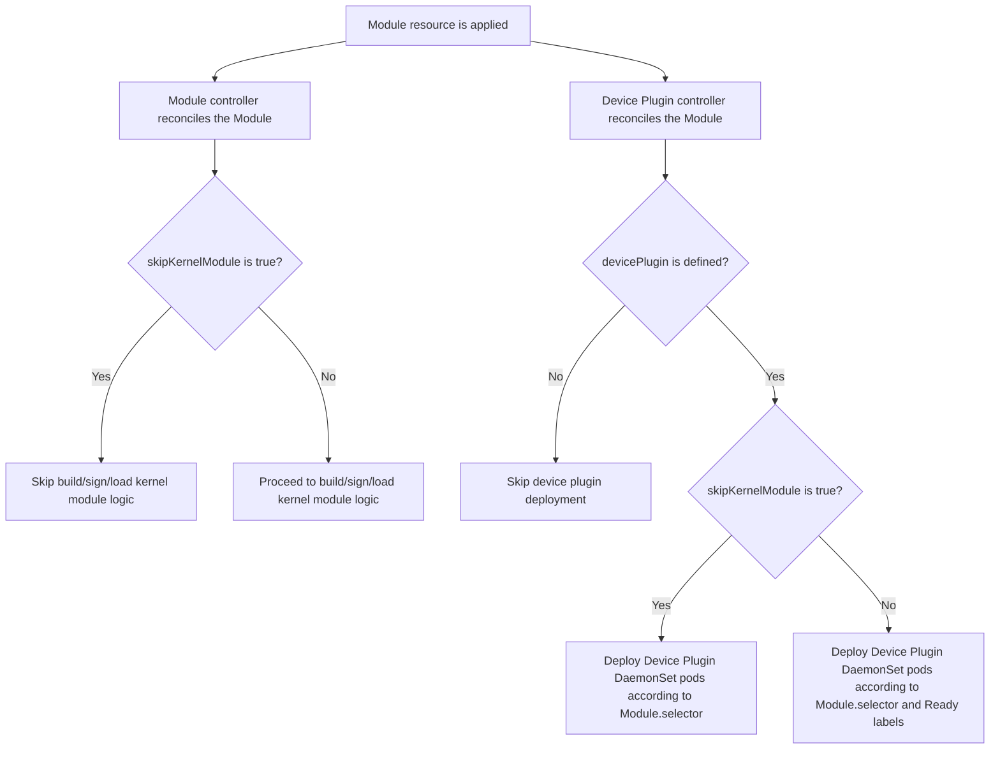

# KMM support for not loading kernel modules when applying Module resource

Authors: @TomerNewman

## Introduction
When KMM is used by 3rd party vendor operators, they need an option to configure KMM Module not to load OOT kernel driver,
but use the in-tree one, and just run the device-plugin.
This decision is made by the 3rd pary operator based on its own inputs.
Since currently there is no way to skip loading kernel module via KMM Module,
it causes the 3rd party operator not to use device plugin functionality of the KMM, but to deploy it by the operator itself.

## Goals
1. The purpose of this feature is to allow users to deploy a Module in order to use its device plugin functionality only,
without building or loading kernel modules.

### Note
This change should not break Ordered Upgrade feature, Because when creating a Module resource without loading oot kernel module,
Order Upgrade is simply not relevant.

## Design

### A new flag for Module CRD - `skipKernelModule`

This feature introduces a `skipKernelModule` optional boolean flag that will be added to Module.Spec, will be defaulted to false.
Whenever `skipKernelModule` is set to True, Module controller will skip building/loading the module.
In addition, when `skipKernelModule` is set to True and `module.spec.devicePlugin != nil`, the device plugin controller
will schedule the DeamonSet's pods on the nodes that described in `module.spec.selector` **only**, without referring
to the kernel module's labels.

##### Example Resource:
```yaml
apiVersion: kmm.sigs.x-k8s.io/v1beta1
kind: Module
metadata:
  name: my-kmod
spec:
  skipKernelModule: true
  moduleLoader:
    ...
  devicePlugin: 
    ...
  selector:
    node-role.kubernetes.io/worker: ""
```

#### flow chart:


